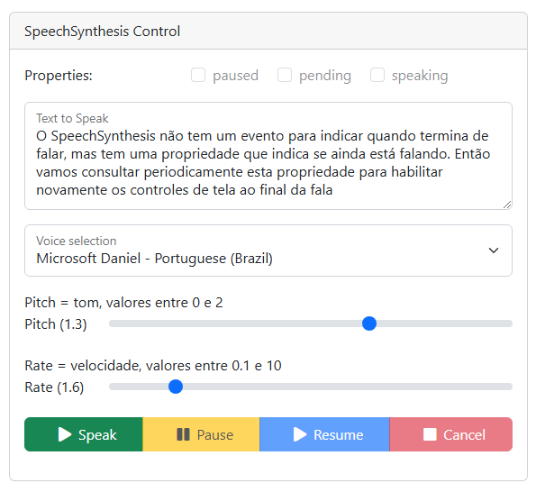

# speech-synthesis

Uma interface de síntese de fala, também conhecida como texto para fala (TTS), é uma tecnologia que converte texto escrito em fala artificial, permitindo que computadores, softwares e dispositivos eletrônicos "leiam" em voz alta para os usuários.

O Mozilla desde Setembro de 2018 oferece uma interface de síntese de fala chamada [Web Speech API](https://developer.mozilla.org/en-US/docs/Web/API/Web_Speech_API), que permite integrar essa tecnologia aos seus projetos web e navegadores, e é formada por dois componentes: SpeechRecognition e

O componente [SpeechRecognition](https://developer.mozilla.org/en-US/docs/Web/API/SpeechRecognition) controla o serviço de reconhecimento de voz. Em alguns navegadores, por exemplo o Chrome, o áudio é enviado para ser processado através de um web servoce, então ele só funciona online.

O componente [SpeechSynthesis](https://developer.mozilla.org/en-US/docs/Web/API/SpeechSynthesis) controla o serviço de fala, e pode ser usado para obter informações sobre as vozes sintetizadas disponíveis no dispositivo, reproduzir e pausar uma locução, além de outros comandos.

## Funcionalidades

Este projeto exemplifica como usar o recurso SpeechSynthesis, via javascript, para ler um texto.

As funcionalidades são:
- selecionar uma das vozes disponíveis no dispositivo
- escolher o tom (*pitch*) da fala
- escolher a velocidade (*rate*) da fala
- digitar um texto para ser lido
- iniciar leitura deste texto (botão *Speak*)
- pausar, reiniciar ou cancelar a fala (respectivamene botões *Pause*, *Resume* e *Cancel*).

Os comandos de tela ficam desabilitados enquanto o texto está sendo reproduzido.


## Pré-requisitos

Somente um navegador...

O SpeechSynthesis é um recurso nativo do navegador e é acessado por javascript, a interface visual foi feita usando o [Bootstrap 5](https://getbootstrap.com/) e ícones do [Font Awesome](https://fontawesome.com/).

## Install & Run

No terminal, digitar:

```bash
git clone git clone http://github.com/gtnasser/speech-synthesis
cd speech-synthesis
```

Abrir o arquivo html utilizando um navegador.

No windows pode-se clicar duas vezes no arquivo *index.html* ou ainda no terminal, digitar:
```
start index.html
```


>

>*Fig1 -* Tela do projeto.

